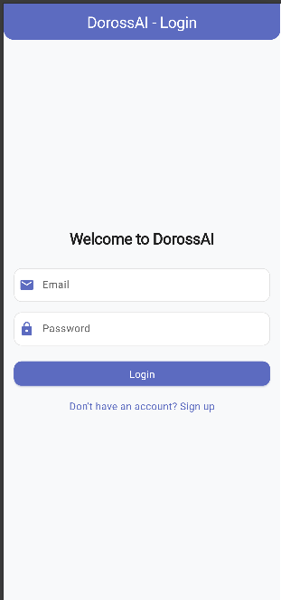
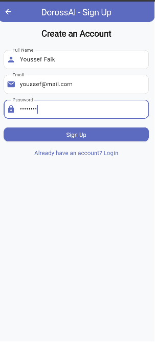
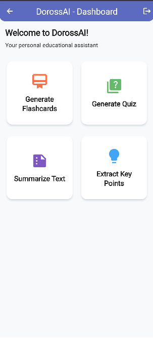
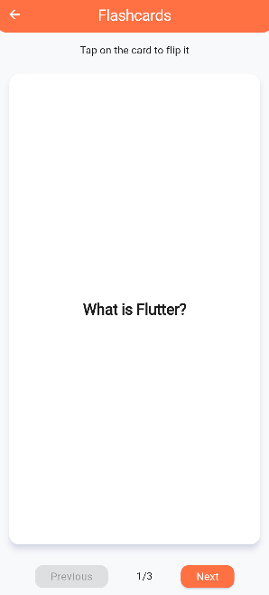
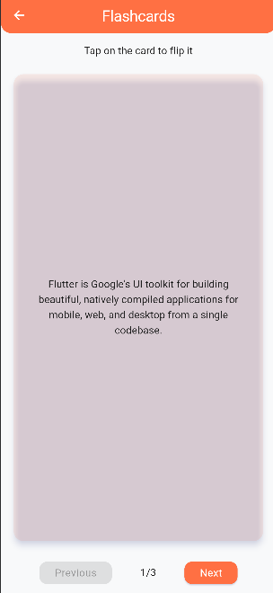
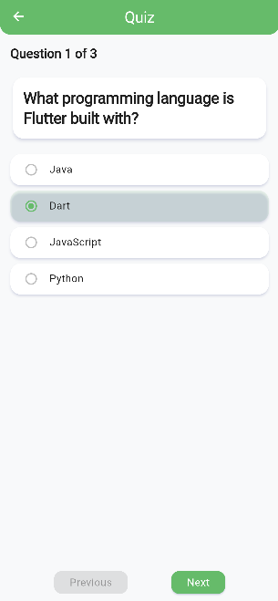

# DorossAI - Your Personal Educational Assistant

DorossAI is a Flutter-based mobile application designed to enhance your learning experience through AI-powered educational tools. The app provides various features to help students and learners efficiently process and understand educational content.

## Features

### Authentication
DorossAI provides a secure authentication system to protect your personal learning data.

- **Login**: Access your account with email and password
  
- **Sign Up**: Create a new account with your name, email, and password
  

### Dashboard
The home screen provides easy access to all the app's features through an intuitive card-based interface.


### Flashcard Generation
Create digital flashcards to help with memorization and quick review of important concepts.

- Tap on cards to flip between question and answer
- Navigate between multiple cards with previous and next buttons
- Perfect for spaced repetition learning technique
  

### Quiz Generation
Test your knowledge with automatically generated quizzes.

- Multiple-choice questions to test your understanding
- Navigate between questions with previous and next buttons
- Track your progress through the quiz
  

### Text Summarization
Quickly understand the main points of lengthy texts with AI-powered summarization.

- Paste any text you want to summarize
- Get a concise summary highlighting the most important information
- Save time on reading while still capturing key concepts
  

### Key Points Extraction
Extract the most important points from any text to focus your studying on what matters most.

- Paste text from lectures, textbooks, or articles
- Get a bulleted list of the most important concepts
- Helps identify what to focus on when studying

## Installation

1. **Prerequisites**:
   - Flutter SDK (latest stable version)
   - Android Studio or VS Code with Flutter extensions
   - An Android or iOS device/emulator

2. **Clone the repository**:
   ```
   git clone https://github.com/yourusername/dorossai.git
   ```

3. **Install dependencies**:
   ```
   cd dorossai
   flutter pub get
   ```

4. **Run the app**:
   ```
   flutter run
   ```

## Usage

1. **Authentication**: Start by creating an account or logging in
2. **Dashboard**: From the home screen, select the feature you want to use
3. **Input**: For text-based features (summarize, key points), paste your text and click the action button
4. **Review**: Use the generated content for your learning needs

## Technologies Used

- **Flutter**: Cross-platform UI toolkit for building natively compiled applications
- **Dart**: Programming language optimized for building mobile, desktop, server, and web applications
- **Material Design**: Visual language that synthesizes the classic principles of good design with innovation

## Future Enhancements

- Cloud synchronization for saving generated content
- Customizable themes and accessibility options
- Export functionality for sharing generated content
- Integration with popular learning management systems
- Voice input for text-based features

## Contributing

Contributions are welcome! Please feel free to submit a Pull Request.

## License

This project is licensed under the MIT License - see the LICENSE file for details.
